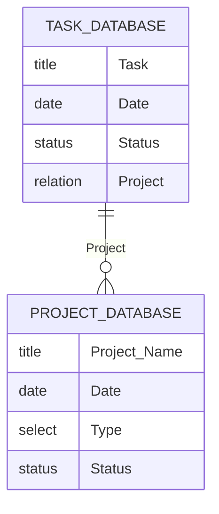

# alfred-notion-task  
  
A workflow for adding a task to Notion's task database quickly.  
When adding a new task, you can specify the current date or a relation that is linked to another database.
  

  
> [!CAUTION]  
> The specific property names of Notion Database are my own, so please adapt them to your use case if you need.  

Here is my Notion database schema:  

  