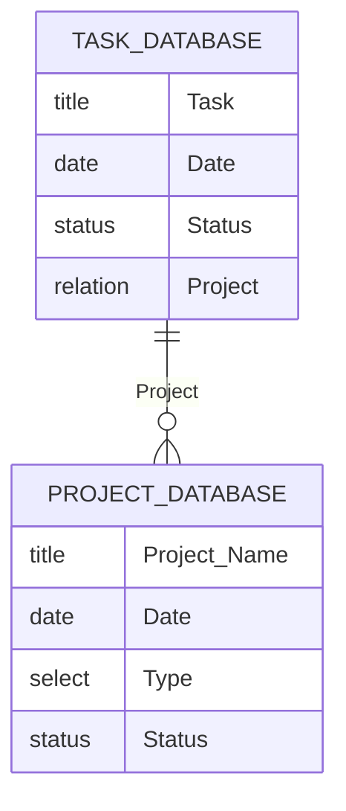

# alfred-notion-task  
  
A workflow for adding a task to Notion's task database quickly.  
When adding a new task, you can specify the current date or a relation that is linked to another database.


  
## Usage  

```text
nt [task] <t|today>
```  

**Press Enter** : Add a task with the current date(optionally).  
**⌘ + Enter** : Add a task with a project relation.

You can incrementally search for a project name.  

```text  
[task] <t|today> <project>  
```  
  
If you want to cancel adding a relation, press **⌘ + Enter** again.  

## Installation  

1. Download the latest release from the [release page](https://github.com/yumikokh/alfred-notion-task/releases)
2. Double-click the downloaded file to install the workflow in Alfred.  
3. [Set the environment variables](https://arc.net/l/quote/ksunopdk) in the workflow settings.  
   - `NOTION_API_TOKEN` : The API token of your [Notion integration](https://developers.notion.com/docs/create-a-notion-integration).
   - `TASK_DATABASE_ID` : The ID of the database you want to add a task to.  
   - `PROJECT_DATABASE_ID` : The ID of the database that is related to the task database.  
  
> [!CAUTION]  
> The specific property names of Notion Database are my own and **they are hard-coded**.  
> please adapt them to your use case if you need.

Here is my Notion database schema:  


  