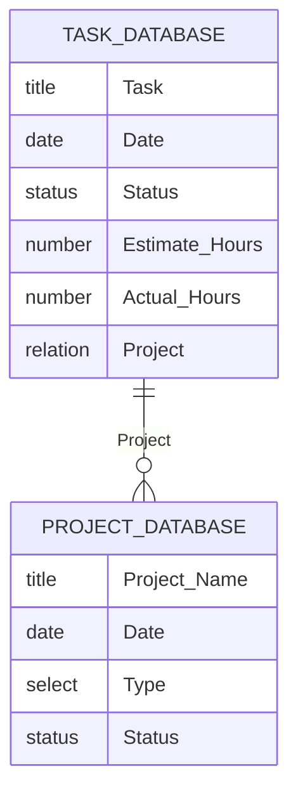

# alfred-notion-task

A workflow for managing Notion tasks and starting Toggl Track timers from Alfred.


## Usage

### List tasks (`nta`)

```text
nta
```

Show tasks with status "Ready" or "In Progress" that are scheduled for today or before.

- **Enter** : Start Toggl Track timer for the selected task
- **⌘ + Enter** : Open the task in Notion

### Add a new task

```text
nta [task] <t|today>
```

- **Enter** : Add a task with the current date (optionally)
- **⌘ + Enter** : Add a task with a project relation

You can incrementally search for a project name:

```text
[task] <t|today> <project>
```

If you want to cancel adding a relation, press **⌘ + Enter** again.

### Refresh cache (`ntr`)

```text
ntr
```

Clear the task and project cache.

## Installation

1. Download the latest release from the [release page](https://github.com/yumikokh/alfred-notion-task/releases)
2. Double-click the downloaded file to install the workflow in Alfred
3. [Set the environment variables](https://arc.net/l/quote/ksunopdk) in the workflow settings:

### Required

- `NOTION_API_TOKEN` : The API token of your [Notion integration](https://developers.notion.com/docs/create-a-notion-integration)
- `TASK_DATABASE_ID` : The ID of the task database
- `RELATION_DATABASE_ID` : The ID of the project database

### Optional (for Toggl Track integration)

- `TOGGL_API_TOKEN` : Your [Toggl Track API token](https://track.toggl.com/profile)
- `TOGGL_WORKSPACE_ID` : Your Toggl workspace ID

> [!NOTE]
> When starting a timer, the workflow automatically matches Notion project names with Toggl project names.

> [!CAUTION]
> The specific property names of Notion Database are my own and **they are hard-coded**.
> Please adapt them to your use case if you need.

## Notion Database Schema


```mermaid
erDiagram
    TASK_DATABASE {
        title Task
        date Date
        status Status
        number Estimate_Hours
        number Actual_Hours
        relation Project
    }

    PROJECT_DATABASE {
        title Project_Name
        date Date
        select Type
        status Status
    }

    TASK_DATABASE ||--o{ PROJECT_DATABASE: Project
```
  